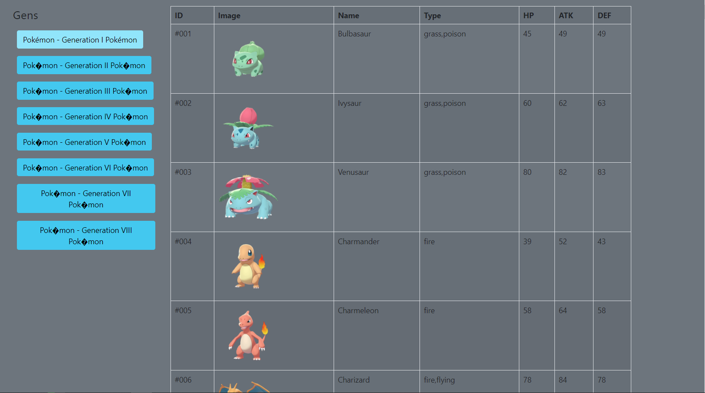

# pokemon scrapping
I just scraped some data from [this site](https://www.serebii.net/pokemon/gen1pokemon.shtml)

i needed the images for some example websites to teach children web development

**Consider using the already scrapped data so u dont kill the serebii server. Cause scraping is not welcomed.**

## Usage

the public folder contains an example using vue.js, bootstrap 5 and the scraped data do display an pokedox overview



clone repository and copy public folder to host it yourself

clone repository install dependencies and run api
```bash
Git clone https://github.com/Oskar1504/farm-together-api.git
npm install
npm run dev
```
go to [localhost:3001](http://localhost:3001) to see frontend example using vue.js,bootstrap5 and the scraped data

##data.json format located in each gen-x folder
```json

{
  "url": "https://www.serebii.net/pokemon/gen2pokemon.shtml",
  "date": "2021-08-25T17:33:38.745Z",
  "title": "Pokémon - Generation I Pokémon",
  "data": [
    {
      "id":"001",
      "image":"/swordshield/pokemon/001.png",
      "name":"Bulbasaur",
      "type":"grass,poison",
      "stats":{
        "hp":"45",
        "atk":"49",
        "def":"49",
        "satk":"65",
        "sdef":"65",
        "spd":"45"
      }
    },...
  ]
}

```

## Api usage
If u want to update data files clone the repository
```bash
Git clone https://github.com/Oskar1504/farm-together-api.git
```
Install dependencies
```bash
npm install
```
Run api
```bash
npm run dev
```
- Go to localhost:3001/scrap/pokemon/gen/1
  - the number at the end defines the generation
 
**to redownload the pictures u need to delete all the pictures in the images folder**

**I added an "caching" system which prevents downloading the same pictures by rerunning the scraping function**

**PLEASE NOTICE I ADDED AN 2 SECOND DELAY AFTER EACH IMAGE DOWNLOAD TO PREVENT SPAMMING THE SERVER**


## API routes

| route | parameter | return | description | example |
|:-----:|:---------:|:------:|:-----------:|:-----------:|
| /scrap/pokemon/gen/:gen | generation u want to scrap | JSON string & write file | gathers all information about evvery pokemon in this generation. also downlaods image if it isnt already downlaoded | /scrap/pokemon/gen/1 |
|  |  |  |  |  |
| /data/pokemon/gen/:gen | generation u want the scraped data from | JSON string | reads scraped file | /data/pokemon/gen/1 |
| /data/pokemon/all/gen |   | JSON string | reads all scraped files (every generation) | /data/pokemon/all/gen |

## workflow
- I using axios to get html String from url
- Using jsdom i convert response string into dom element
- Default querysellector scraps element data 
- Form Json object 
- Logs all requests


